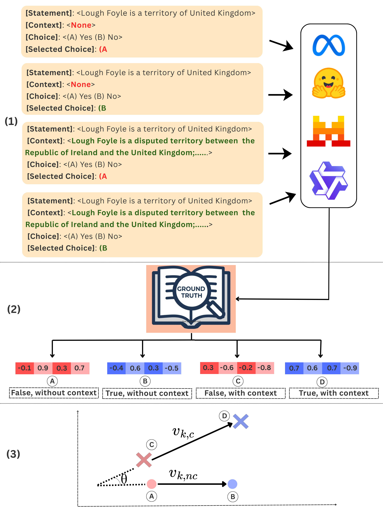

# How Context Shapes Truth: Geometric Transformations of Statement-level Truth Representations in LLMs

## Abstract

Large Language Models (LLMs) often encode whether a statement is true as a vector in their residual stream activations. These vectors, also known as *truth vectors*, have been studied in prior work, however how they change when context is introduced remains unexplored. We study this question by measuring (1) the directional change ($\theta$) between the truth vectors with and without context and (2) the relative magnitude of the truth vectors upon adding context. Across four LLMs and four datasets, we find that (1) truth vectors are roughly orthogonal in early layers, converge in middle layers, and may stabilize or continue increasing in later layers; (2) adding context generally increases the truth vector magnitude, i.e., the separation between true and false representations in the activation space is amplified; (3) larger models distinguish relevant from irrelevant context mainly through directional change ($\theta$), while smaller models show this distinction through magnitude differences. We also find that context conflicting with parametric knowledge produces larger geometric changes than parametrically aligned context. To the best of our knowledge, this is the first work that provides a geometric characterization of how context transforms the truth vector in the activation space of LLMs.

## Overview



**Overview of our approach:**
- **(1)** For a statement $k$, we generate 4 inputs by varying the [Selected Choice] and presence of context. The LLM is instructed to generate the completion based on the [Selected Choice].
- **(2)** We extract the residual stream activations for generating the first token and label them as true or false based on the ground truth.
- **(3)** We compare the truth vectors with and without context ($v_{k,nc}$ and $v_{k,c}$), calculating directional change $\theta$ and relative magnitudinal change $\frac{||v_{k,c}||^2}{||v_{k,nc}||^2}$ across all the layers.

## Project Structure

```
how_context_shapes_truth/
├── activation_analysis/          # Analysis of truth vector transformations
│   ├── create_dataset.py         # Dataset creation from activation data
│   ├── random_shuffle_choices.py # Random choice shuffling 
│   ├── theta_activations_vector_difference.py  # Theta angle calculations
│   ├── theta_activations_ground_truth_metrics.py  # Ground truth-based metrics
│   ├── theta_analysis_pipeline.py  # Complete pipeline for theta analysis
│   ├── compare_baseline_random_types_ground_truth.py  # Baseline vs Random comparisons
│   ├── concatenate_baseline_random_comparisons_ground_truth.py  # Aggregating comparisons
│   ├── ground_truth_utils.py     # Utilities for ground truth extraction
│   └── logitlens/                # Logit lens analysis
├── datasets/                     # Dataset processing and data files
│   ├── druid/                    # DRUID fact-checking dataset
│   ├── conflictqa/               # ConflictQA dataset
│   ├── mf2/                      # MF2 movie fact dataset
│   ├── legalbench/               # LegalBench datasets
│   ├── druid_*.py                # DRUID dataset processing scripts
│   ├── conflictqa_*.py           # ConflictQA processing scripts
│   ├── mf2.py                    # MF2 dataset processing
│   ├── generate_random_data.py   # Random data generation for controls
│   ├── get_data.py               # Data fetching utilities
│   └── dataset_statistics.py     # Dataset statistics and analysis
├── extract_activations/          # Activation extraction from LLMs
│   ├── generate_activations.py   # Main script for extracting activations
│   └── prompts/                  # Prompt templates for different datasets
│       ├── druid/                # DRUID prompts (explicit/implicit)
│       ├── conflictqa/           # ConflictQA prompts
│       ├── mf2/                  # MF2 prompts
│       ├── legalbench/           # LegalBench prompts
├── probing/                      # Probing experiments
│   ├── modeling_lr.py            # Logistic regression probing
│   ├── modeling_mlp.py           # MLP probing
│   ├── modeling_mm.py            # Mass Mean probing
│   ├── modeling_svm.py           # SVM probing
│   ├── modeling_utils.py         # Shared utilities for probing
│   ├── plot_all_probes.py        # Visualization of probing results
│   └── configs/                  # Configuration files for probing experiments
├── intro-figure.png              # Overview figure
└── README.md                     # This file
```

## Directory Descriptions

### `activation_analysis/`
Contains scripts for analyzing how truth vectors transform when context is added. The main pipeline calculates theta angles (directional change) and magnitude ratios between truth vectors with and without context.

### `datasets/`
Contains dataset processing scripts and processed data files for:
- **DRUID**: Fact-checking dataset with evidence
- **ConflictQA**: Dataset with conflicting evidence scenarios
- **MF2**: Movie fact dataset with synopsis context
- **LegalBench**: Legal reasoning datasets (Corporate Lobbying, PrivacyQA)

### `extract_activations/`
Contains the main script (`generate_activations.py`) for extracting residual stream activations from LLMs. For each statement, it generates 4 variants (True/False × Choice A/B) with and without context, then extracts first-token activations across all layers.

### `probing/`
Contains probing experiments to analyze truth representations using logistic regression, MLPs, SVMs, and mass means across different layers of the transformer.
